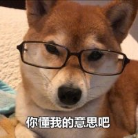

作为一个程序猿，需要对技术有不断的追求；
记录一下最近网上看的技术相关的知识，及收集的一部分面试题

----------

大部分的知识还是看的网上的文章，集百家之所长，收集在一起。

对于系统的知识梳理，可能会转载很多优秀的文章，在此先谢谢各位大佬们。

本文档中的所收集的知识仅限于学习及面试

如果你觉得有不对或者疑问的地方，可以提出

如果你有新的面试题，请添加

<!-- 图片显示 -->
<!--

-->

